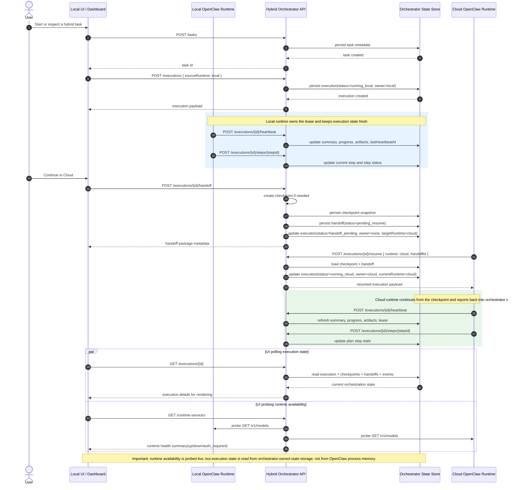

# Local Runtime -> Orchestrator State Store -> Cloud Runtime/UI Sequence

This sequence diagram shows how execution state moves through the current MVP implementation.

- `Orchestrator API` is `services/orchestrator/server.js`
- `State Store` is currently `services/orchestrator/data/orchestrator-state.json`
- In a later production design, the state store should become a shared durable store

## Reading Guide

- `GET /runtime-services` answers: "Is the local/cloud runtime reachable right now?"
- `GET /executions/{id}` answers: "What is the current execution state, owner, checkpoint, plan, and progress?"
- The second answer comes from the orchestrator state store, which the runtimes update through orchestrator APIs.
