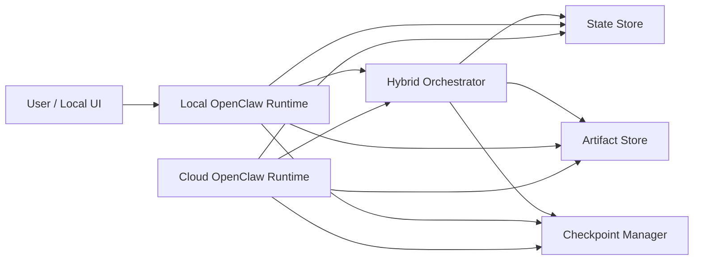
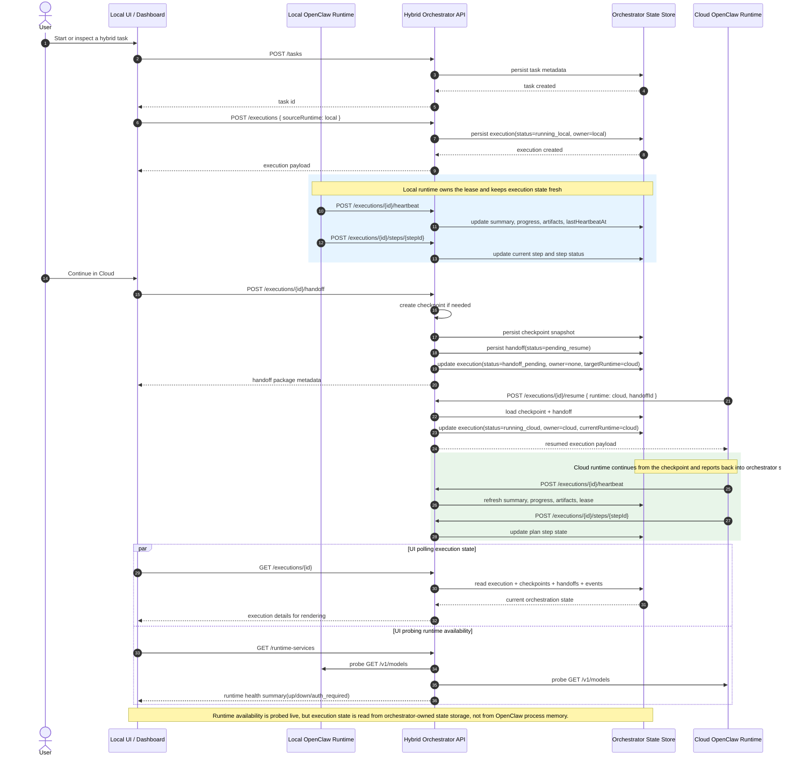

# OpenClaw-Based Hybrid Agent Architecture

## 1. Goal

Build a hybrid agent system where:

- A task starts on a local agent runtime.
- If the task becomes long-running and the user wants to shut down the local machine, execution can be handed off to a cloud agent runtime.
- The handoff includes execution context such as current plan, completed steps, checkpoints, artifacts, and resumable state.
- The cloud runtime continues execution and can later return results back to the local side for review or continued work.

## 2. Design Positioning

OpenClaw should be treated as the **agent runtime substrate** on both local and cloud.

It should **not** be the only orchestration layer.

We add a thin control plane above it:

- `local-openclaw-runtime`
- `cloud-openclaw-runtime`
- `hybrid-orchestrator`
- `state-store`
- `artifact-store`
- `checkpoint-manager`

This separation keeps the runtime reusable while making handoff, ownership, resume, and recovery explicit.

## 3. High-Level Architecture

## 4. Core Principle

The runtime is responsible for **thinking and acting**.

The orchestrator is responsible for **ownership and mobility**.

That means:

- OpenClaw runs the agent loop and tool execution.
- The orchestrator tracks who currently owns an execution.
- Checkpoints are created outside transient in-memory runtime state.
- Handoff is performed with explicit metadata rather than trying to serialize the entire runtime process.

## 5. Main Components

### 5.1 Local OpenClaw Runtime

Responsibilities:

- Start new tasks from the local UI.
- Execute tasks while local resources are available.
- Persist step progress and checkpoint metadata.
- Trigger handoff preparation when the user chooses cloud continuation.

Typical local-only capabilities:

- local filesystem
- browser automation
- desktop apps / GUI
- private intranet access
- user-scoped credentials

### 5.2 Cloud OpenClaw Runtime

Responsibilities:

- Resume a handed-off execution from a stable checkpoint.
- Continue long-running steps.
- Persist new artifacts and progress updates.
- Publish completion state for local recovery.

Typical cloud strengths:

- long uptime
- elastic compute
- centralized logging
- scheduled retries
- team-visible observability

### 5.3 Hybrid Orchestrator

Responsibilities:

- Create and track `task` and `execution` records.
- Manage execution ownership (`local` or `cloud`).
- Enforce lease semantics to prevent double execution.
- Coordinate checkpoint-before-handoff.
- Start cloud resume jobs.
- Handle retry / recovery when handoff fails.

This is the system's real backbone.

### 5.4 State Store

Stores structured execution state:

- task metadata
- execution metadata
- plan versions
- step statuses
- ownership / lease
- event log
- checkpoint index

Suggested early schema families:

- `tasks`
- `executions`
- `execution_steps`
- `execution_events`
- `checkpoints`
- `handoffs`

### 5.5 Artifact Store

Stores larger or binary outputs:

- generated files
- intermediate reports
- model outputs worth resuming from
- browser captures
- imported documents

Artifacts should be referenced by URI from the state store, not embedded inline.

### 5.6 Checkpoint Manager

Responsibilities:

- Create stable checkpoints.
- Mark which checkpoints are resumable.
- Record side effects already completed.
- Package minimal handoff context.

Checkpoint granularity should be step-oriented, not token-oriented.

## 6. Execution Model

### 6.1 Core Entities

#### Task

Represents the user goal, for example:

`Analyze a folder of contracts and produce a summary report`

#### Execution

A concrete run of a task with state and ownership.

#### Plan

A mutable execution plan composed of steps.

Each step should have:

- `step_id`
- `title`
- `status`
- `inputs`
- `outputs`
- `depends_on`
- `retry_policy`
- `side_effect_class`

#### Checkpoint

A resumable snapshot pointer that contains:

- execution id
- plan version
- current step pointer
- completed step list
- artifact references
- summary memory
- environment requirements
- side effect ledger

#### Handoff

An explicit transfer record from one runtime to another.

## 7. Ownership and State Machine

Recommended execution states:

- `created`
- `running_local`
- `checkpointing`
- `handoff_pending`
- `transferring`
- `running_cloud`
- `paused`
- `resume_pending`
- `completed`
- `failed`
- `cancelled`

Recommended ownership model:

- `owner = local | cloud | none`
- `lease_expire_at`
- `resume_from_checkpoint_id`

Rule:

Only one runtime may hold the active execution lease at a time.

## 8. Handoff Flow

### 8.1 Local -> Cloud

1. User chooses `Continue in Cloud`.
2. Local runtime pauses after the current safe boundary.
3. Checkpoint manager creates a stable checkpoint.
4. Orchestrator writes a `handoff_pending` record.
5. Required artifacts are uploaded or referenced.
6. Ownership lease moves from `local` to `cloud`.
7. Cloud runtime loads the handoff package.
8. Cloud runtime resumes from the checkpoint.
9. Execution state becomes `running_cloud`.

### 8.2 Cloud -> Local Result Recovery

1. Cloud runtime completes or pauses.
2. Final checkpoint and artifacts are persisted.
3. Orchestrator marks execution `completed` or `paused`.
4. Local UI fetches execution state and artifacts.
5. User can inspect results or continue with a new local phase.

### 8.3 Current MVP State Flow

The following sequence shows how the current MVP moves execution state between the local runtime, the orchestrator-owned state store, the cloud runtime, and the UI.

This distinction matters:

- `GET /runtime-services` answers whether a runtime endpoint is reachable.
- `GET /executions/{id}` answers what the orchestrator believes the execution state is.
- That execution state is maintained by orchestrator storage and updated by runtime API calls.

## 9. What Must Be In a Handoff Package

Required:

- `task_id`
- `execution_id`
- `source_runtime`
- `target_runtime`
- `checkpoint_id`
- `current_plan`
- `plan_version`
- `step_statuses`
- `execution_summary`
- `artifact_refs`
- `environment_requirements`
- `tool_capability_requirements`
- `side_effect_ledger`

Optional but useful:

- concise reasoning summary
- last N important events
- failure / retry history
- operator notes

## 10. Handling Non-Replayable Side Effects

This is one of the hardest parts and should be modeled explicitly.

Every step should be tagged with a side-effect class:

- `pure_read`
- `replay_safe_write`
- `non_replayable_write`
- `human_confirmed_action`

Examples:

- reading files: `pure_read`
- generating a local draft file: `replay_safe_write`
- sending an email: `non_replayable_write`
- approving a purchase: `human_confirmed_action`

Cloud resume logic must never blindly re-run non-replayable steps.

## 11. OpenClaw Integration Strategy

Use OpenClaw for:

- agent loop execution
- tool invocation
- model/provider routing already supported by the runtime
- local and cloud runtime parity

Build custom components around OpenClaw for:

- execution ownership
- handoff protocol
- checkpoint schema
- artifact synchronization
- resumability rules
- policy for local-only vs cloud-safe tools

In short:

OpenClaw is the **engine**.
The hybrid layer is the **transmission and control system**.

## 12. Capability Routing

Not every tool should be allowed in both runtimes.

Define each tool with a placement policy:

- `local_only`
- `cloud_only`
- `portable`
- `requires_rebinding`

Examples:

- local browser automation: `local_only`
- S3 / blob processing: `portable`
- desktop UI automation: `local_only`
- server batch processing: `cloud_only`
- database access via secret mount: `requires_rebinding`

Before handoff, the orchestrator should validate that remaining steps are executable in cloud.

## 13. MVP Scope

### In scope

- single active execution
- local-to-cloud handoff
- resumable step-based checkpoints
- shared state store
- shared artifact store
- cloud completion and local result viewing

### Out of scope for v1

- simultaneous local + cloud co-execution on the same step
- arbitrary runtime memory serialization
- full collaborative multi-agent scheduling
- general-purpose desktop session transfer
- automatic migration decisions

## 14. Suggested Implementation Sequence

### Phase 1: Domain Model

Implement:

- execution state machine
- task / execution / checkpoint schema
- side-effect classification

### Phase 2: Persistence Layer

Implement:

- state store adapter
- artifact store adapter
- checkpoint writer / loader

### Phase 3: Runtime Adapter

Wrap OpenClaw runtimes with:

- start execution
- pause at safe boundary
- export resumable checkpoint
- resume from checkpoint

### Phase 4: Handoff Orchestration

Implement:

- local handoff request
- checkpoint validation
- lease transfer
- cloud resume job

### Phase 5: Developer UX

Implement:

- execution timeline view
- handoff action
- resume / retry controls
- checkpoint inspection

## 15. Recommended First Technical Deliverables

The next concrete outputs should be:

1. `architecture decision record` for why OpenClaw is runtime-only, not orchestrator
2. `execution data model` document
3. `handoff protocol` draft
4. `MVP API contract` for local runtime, orchestrator, and cloud runtime

## 16. Proposed Next File

The most useful next file is:

`docs/mvp-api-contract.md`

That document should define:

- `POST /tasks`
- `POST /executions`
- `POST /executions/{id}/checkpoint`
- `POST /executions/{id}/handoff`
- `POST /executions/{id}/resume`
- `GET /executions/{id}`
- `GET /executions/{id}/events`

